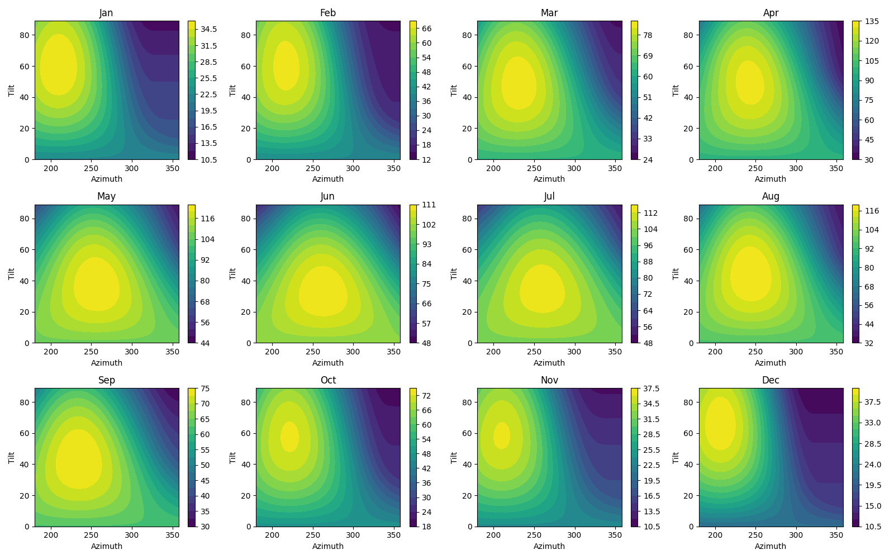
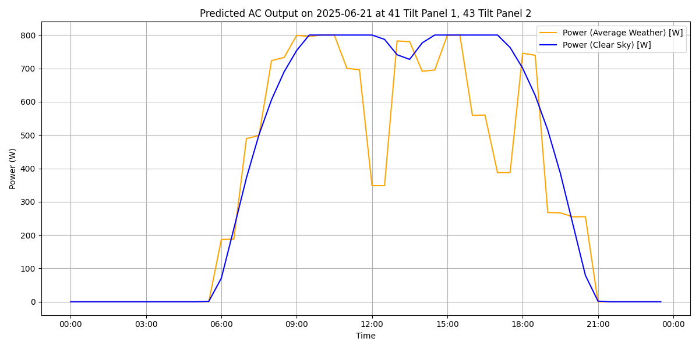

# Simulator for small photovoltaics setups

I recently installed a tiny solar setup (920 Wp) on my balcony and wanted to optimize the orientation of the panels for my specific setup.
But I couldn't find a single calculator that fit all of my requirements.

So I had AI write this script for me.
It's somewhat specific to my setup, but I kept it configurable such that it probably works for many small solar setups.


## Features

Like most "simple" scripts, this stands on shoulders of giants:
[pvlib](https://pvlib-python.readthedocs.io/en/stable/) does all the hard work.

* Average weather for the selected location from [PVGIS](https://joint-research-centre.ec.europa.eu/photovoltaic-geographical-information-system-pvgis_en)
* Panel and inverter simulation using the CEC model
* Customizable horizon profile per panel
* Sweeps over two parameters (e.g., azimuth and tilt) to find the optimum
* Draws pretty plots

My original motivation was calculating a setup on west-facing balcony.
Virtually all online calculators just fail completely in this scenario, even those supposedly optimized for balcony setups.
As a rule of thumb if an online calculator tells you the optimal tilt for a solar panel on a west-facing balcony is 0°, then it's just wrong.

The only online calculator that I could find that passes this test seems to be the EU's [PVGIS calculator](https://re.jrc.ec.europa.eu/pvg_tools/en/).
But it's a bit cumbersome to use (to be fair, my script is probably even harder to use).
More importantly it doesn't support a few other things I wanted to model, for example, different horizon profiles for the different panels and the inverter clipping the output from the panels at the peaks.


## Usage

Adjust `config.py`, then run `python3 solar_calc.py`.


## Example 1: West-facing balcony

The example config in `config.py` models a small PV setup with 920 Wp on a balcony facing exactly 180° west with a ~181° field of view.

It calculates the best orientation for each month, season and over the whole year as well as a few extra graphs.

Here's how the optimum orientation changes over the year when setting the location to Munich, Germany and using a very fine-granular simulation.



It also outputs the key results as numbers:

```
Summer optimum: Azimuth: 248, Tilt: 41, Total Production: 688.5 kWh
Winter optimum: Azimuth: 216, Tilt: 57, Total Production: 315.9 kWh
Yearly optimum: Azimuth: 236, Tilt: 46, Total Production: 985.7 kWh
Total energy when not adjusting orientation: 985.7 kWh
Total energy when adjusting at equinoxes: 1004.4 kWh
Total energy when adjusting monthly: 1011.5 kWh
```

Simulating the same scenario in Hamburg, Germany instead yields this:

```
Summer optimum: Azimuth: 246, Tilt: 40, Total Production: 652.8 kWh
Winter optimum: Azimuth: 214, Tilt: 55, Total Production: 188.7 kWh
Yearly optimum: Azimuth: 237, Tilt: 43, Total Production: 830.2 kWh
Total energy when not adjusting orientation: 830.2 kWh
Total energy when adjusting at equinoxes: 841.5 kWh
Total energy when adjusting monthly: 847.2 kWh
```

I find it kinda surprising that adjusting the panels over the year doesn't to be that impactful in this particular scenario.

## Example 2: Combining west-facing and east-facing panels

The example config in `example_config_east_west_panels.py` models a setup with an east-facing and a west-facing balcony, each has two 460 Wp panels connected in series.
It optimizes the tilts of the panels on both sides at a fixed azimuth.

All four panels share an inverter limited to 800W, so this is also an example showcasing inverter clipping which very few of the online calculators support.
On a typical summer day the overall power output looks like this.



And yes, you can get more power out at specific times on a cloudy day vs. a perfectly clear day: diffuse light from clouds can be better than a clear sky if your panel is in the shadow of a building.

## Caution: Code is ~80% AI generated

This was mostly an experiment in trying out a bit more vibe coding with frameworks and tools that I'm not familiar with.
It seems to be correct, at least it passes all plausibility checks I could come up with and the results match my real setup pretty well.
Anyhow, parts of the code and comments are a bit odd and I didn't bother cleaning it up.
